## MEAN STACK DEPLOYMENT TO UBUNTU IN AWS

### Step 1 Installing NodeJs

To install NodeJs,I will first update,upgrade and add certificates to Ububtu

*Update Ubuntu*

`sudo apt update`

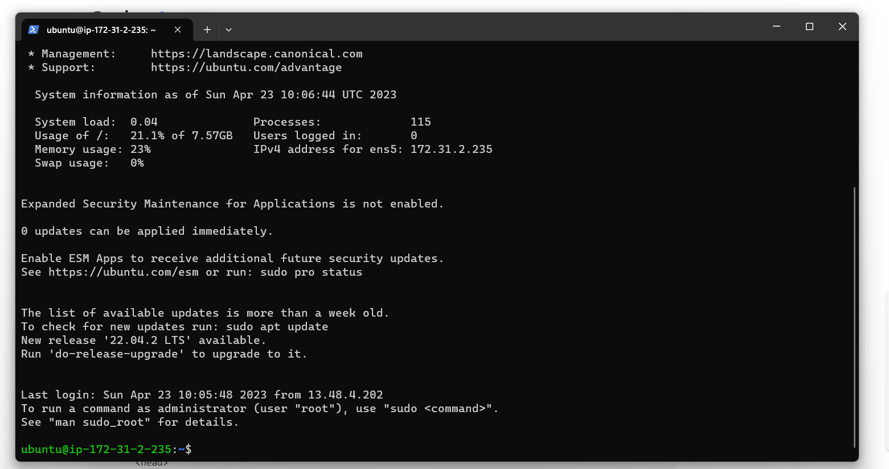
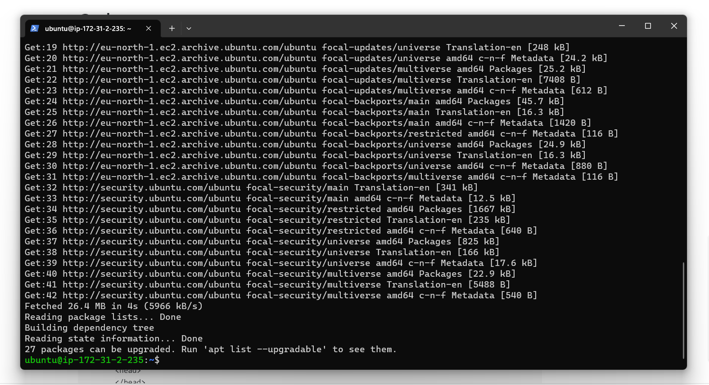

*Upgrade Ubuntu*

`sudo apt upgrade`

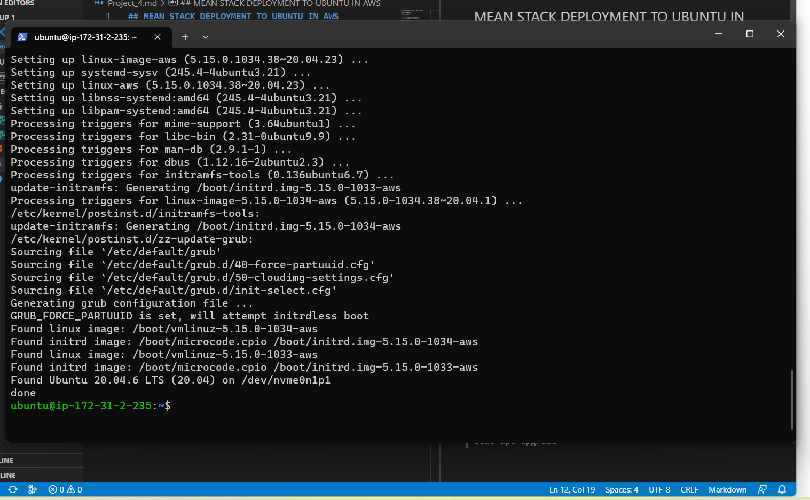

*Adding certificates*

`sudo apt -y install curl dirmngr apt-transport-https lsb-release ca-certificates

curl -sL https://deb.nodesource.com/setup_12.x | sudo -E bash -`

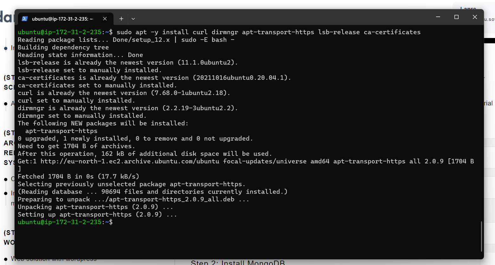

*Installing NodeJs*

`sudo apt install -y nodejs`

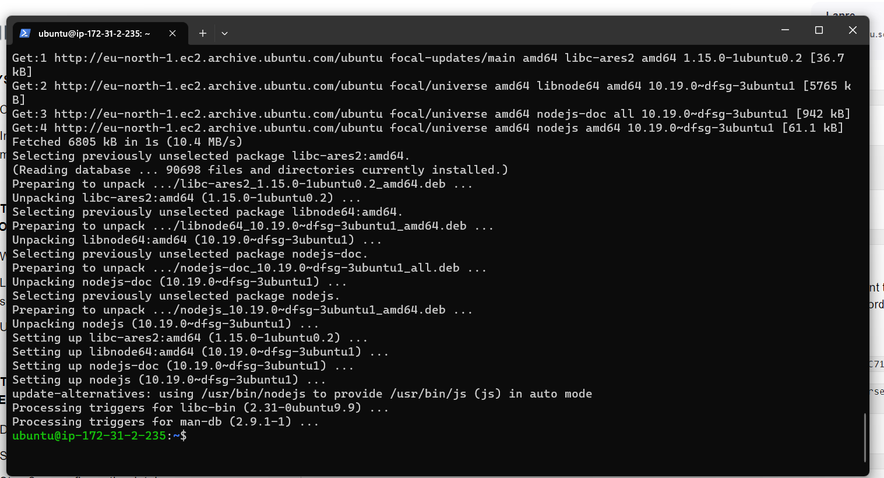

### Step 2 Installing MongoDB

`sudo apt-key adv --keyserver hkp://keyserver.ubuntu.com:80 --recv 0C49F3730359A14518585931BC711F9BA15703C6`

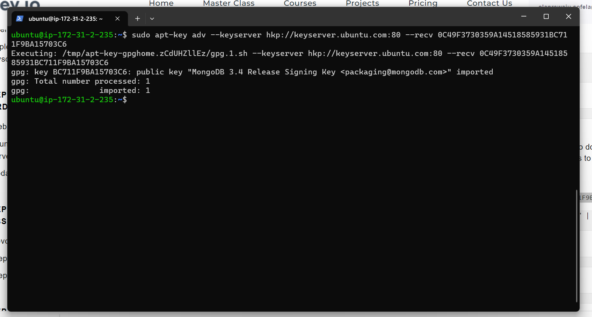

`echo "deb [ arch=amd64 ] https://repo.mongodb.org/apt/ubuntu trusty/mongodb-org/3.4 multiverse" | sudo tee /etc/apt/sources.list.d/mongodb-org-3.4.lis`

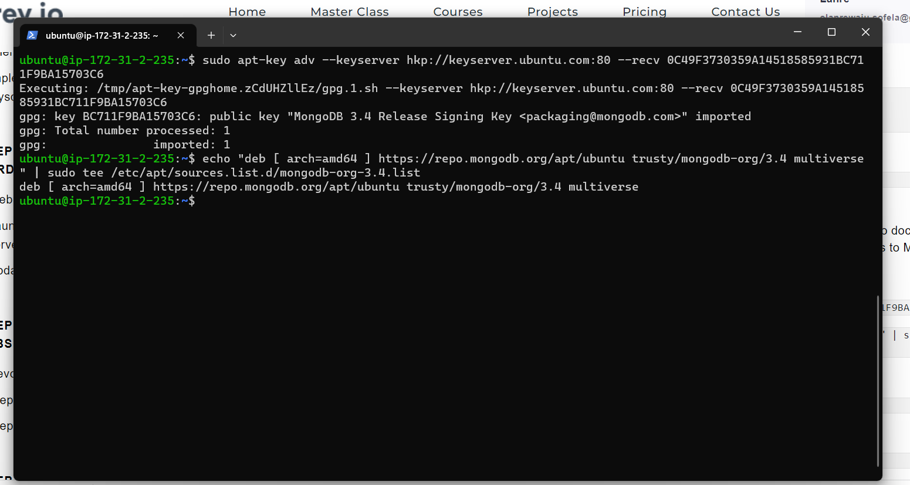

*Installing MongoDB*

`sudo apt install -y mongodb`

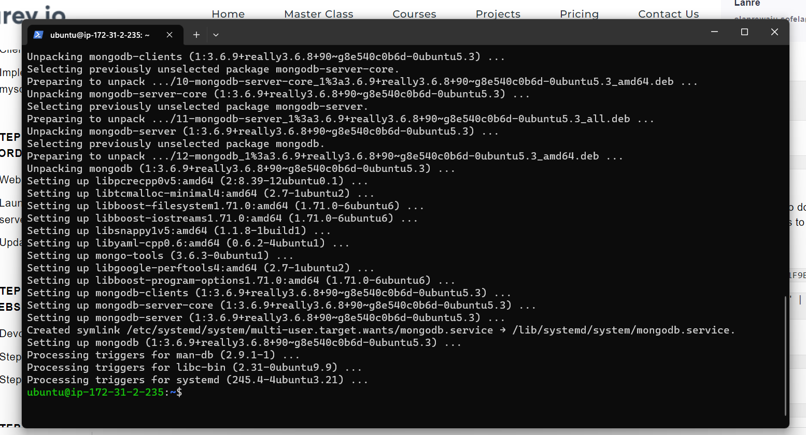

*Starting the server*

`sudo service mongodb start`

*Verify the server*

`sudo systemctl status mongodb`

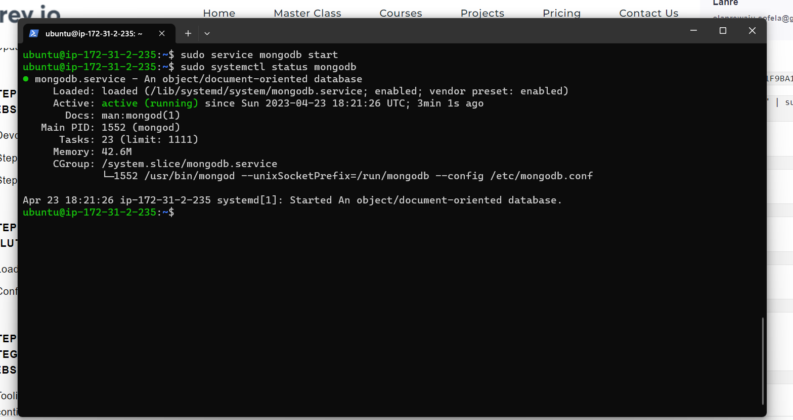

*Install npm – Node package manager*

`sudo apt install -y npm`

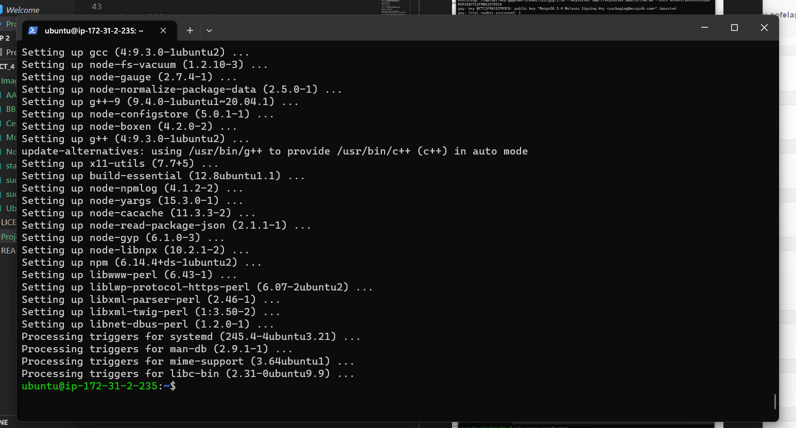

We need ‘body-parser’ package to help us process JSON files passed in requests to the server

*Installing npm body-parser*

`sudo npm install body-parser`

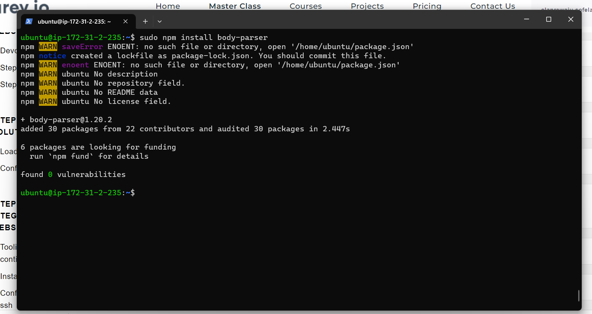

*Create a folder named ‘Books*

`mkdir Books && cd Books`

*Initialize npm project in Books Directory*

`npm init`

*Add a file to it named server.js*

`touch server.js`

`vi server.js`

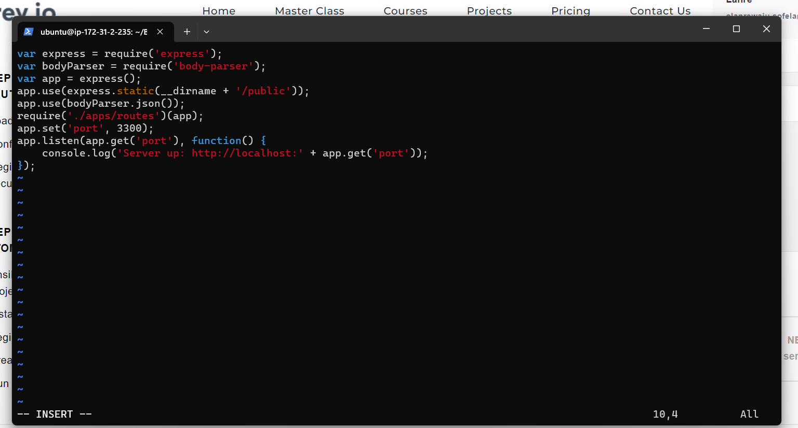

### Step 3: Install Express and set up routes to the server

We will use Express in to pass book information to and from our MongoDB database.

We also will use Mongoose package which provides a straight-forward, schema-based solution to model your application data. We will use Mongoose to establish a schema for the database to store data of our book register.

*Installing express mongoose*

`sudo npm install express mongoose`

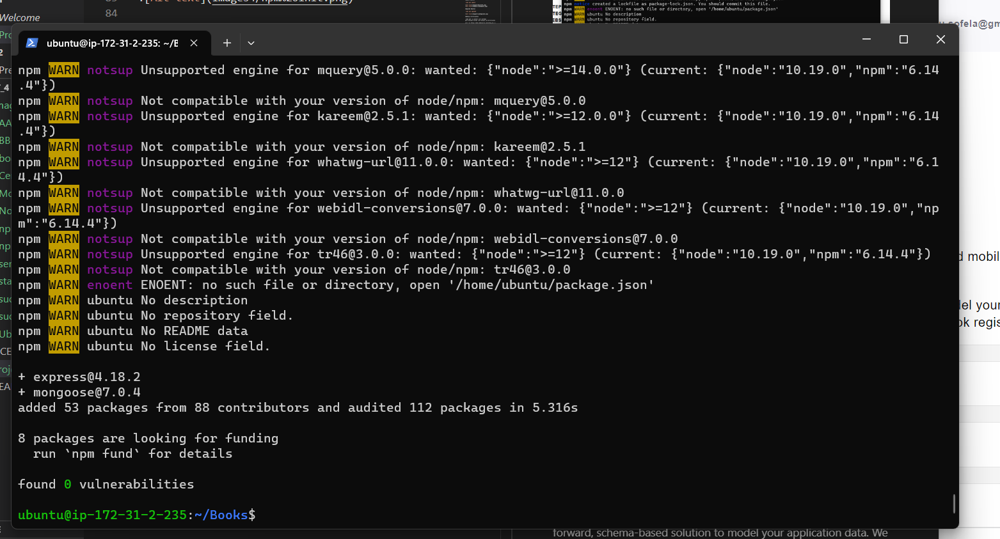

*create a folder named apps in Books directory*

`mkdir apps && cd apps`

*create a file named routes.js*

`touch routes.js`

*Copy and paste the below code*

`vi routes.js`

`var Book = require('./models/book');
module.exports = function(app) {
  app.get('/book', function(req, res) {
    Book.find({}, function(err, result) {
      if ( err ) throw err;
      res.json(result);
    });
  }); 
  app.post('/book', function(req, res) {
    var book = new Book( {
      name:req.body.name,
      isbn:req.body.isbn,
      author:req.body.author,
      pages:req.body.pages
    });
    book.save(function(err, result) {
      if ( err ) throw err;
      res.json( {
        message:"Successfully added book",
        book:result
      });
    });
  });
  app.delete("/book/:isbn", function(req, res) {
    Book.findOneAndRemove(req.query, function(err, result) {
      if ( err ) throw err;
      res.json( {
        message: "Successfully deleted the book",
        book: result
      });
    });
  });
  var path = require('path');
  app.get('*', function(req, res) {
    res.sendfile(path.join(__dirname + '/public', 'index.html'));
  });
};`

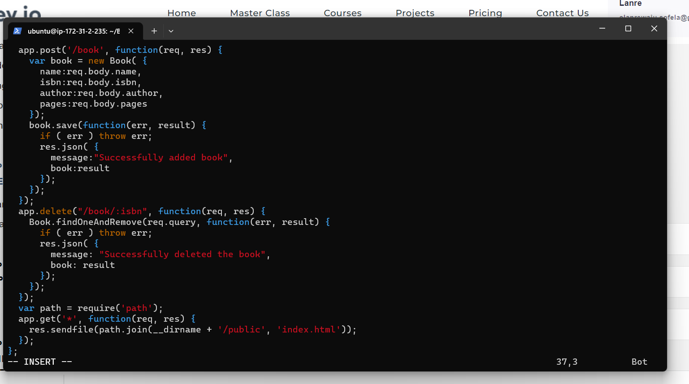

*In the ‘apps’ folder, create a folder named models*

`mkdir models && cd models`

*In the models create a file named book.js*

`touch book.js`

*Copy and paste the below code*

`vi book.js`

`var mongoose = require('mongoose');
var dbHost = 'mongodb://localhost:27017/test';
mongoose.connect(dbHost);
mongoose.connection;
mongoose.set('debug', true);
var bookSchema = mongoose.Schema( {
  name: String,
  isbn: {type: String, index: true},
  author: String,
  pages: Number
});
var Book = mongoose.model('Book', bookSchema);
module.exports = mongoose.model('Book', bookSchema);`

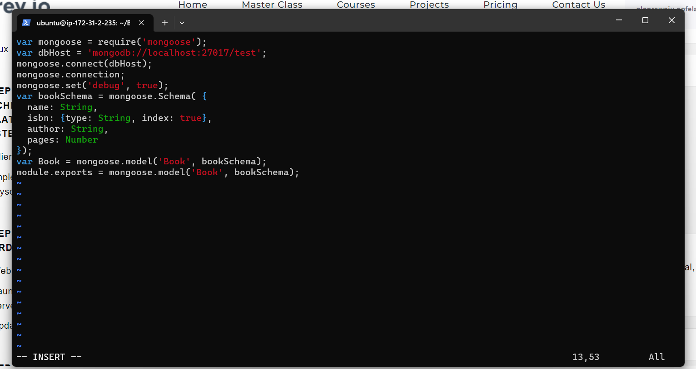

### Step 4 – Access the routes with AngularJS

AngularJS to connect our web page with Express and perform actions on our book register.

*Change the directory back to ‘Books*

`cd ../..`

*Create a folder named public*

`mkdir public && cd public`

*Add a file named script.js*

`touch script.js`

*Copy and paste the below code *

`vi script.js`

`var app = angular.module('myApp', []);
app.controller('myCtrl', function($scope, $http) {
  $http( {
    method: 'GET',
    url: '/book'
  }).then(function successCallback(response) {
    $scope.books = response.data;
  }, function errorCallback(response) {
    console.log('Error: ' + response);
  });
  $scope.del_book = function(book) {
    $http( {
      method: 'DELETE',
      url: '/book/:isbn',
      params: {'isbn': book.isbn}
    }).then(function successCallback(response) {
      console.log(response);
    }, function errorCallback(response) {
      console.log('Error: ' + response);
    });
  };
  $scope.add_book = function() {
    var body = '{ "name": "' + $scope.Name + 
    '", "isbn": "' + $scope.Isbn +
    '", "author": "' + $scope.Author + 
    '", "pages": "' + $scope.Pages + '" }';
    $http({
      method: 'POST',
      url: '/book',
      data: body
    }).then(function successCallback(response) {
      console.log(response);
    }, function errorCallback(response) {
      console.log('Error: ' + response);
    });
  };
});`

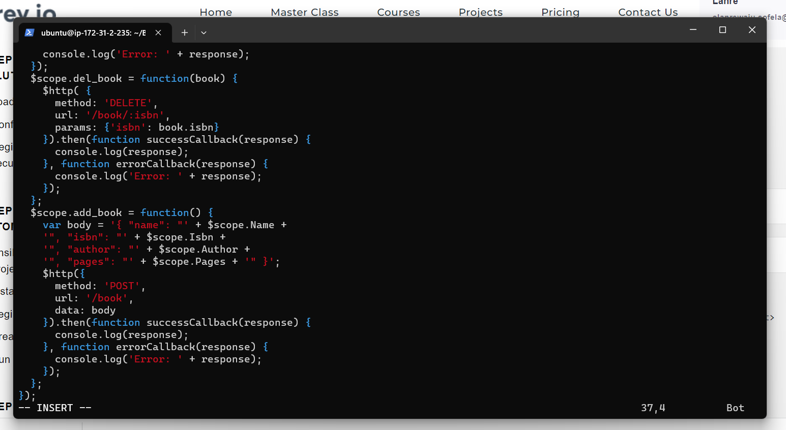

*In public folder, create a file named index.html; *

`touch index.html`

`vi index.html`

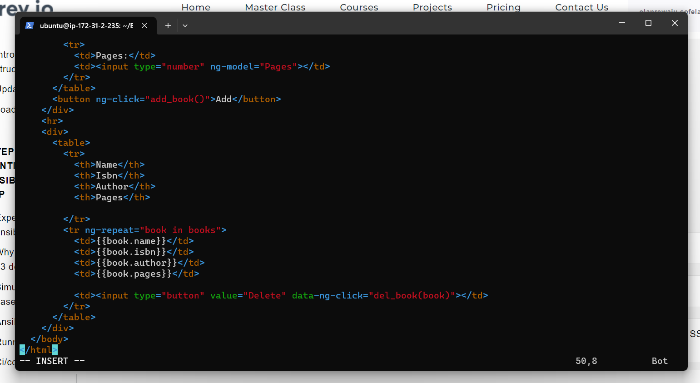

*Change the directory back up to Books *

`cd ..`

*Start the server by running this command: *

`node server.js`

`curl -s http://localhost:3300`

